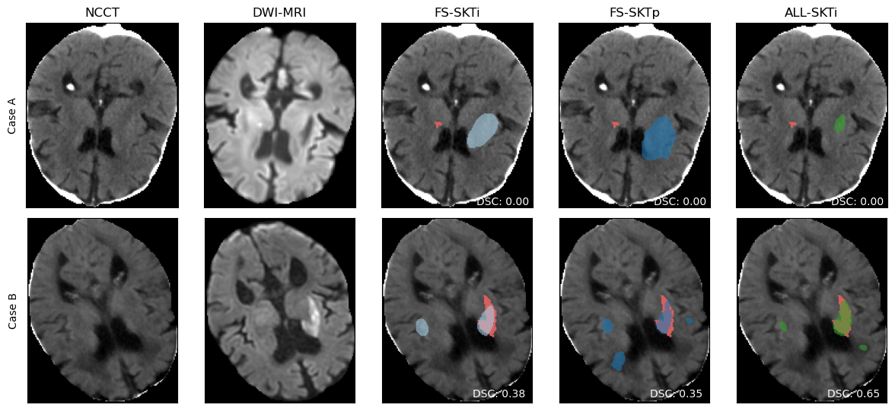
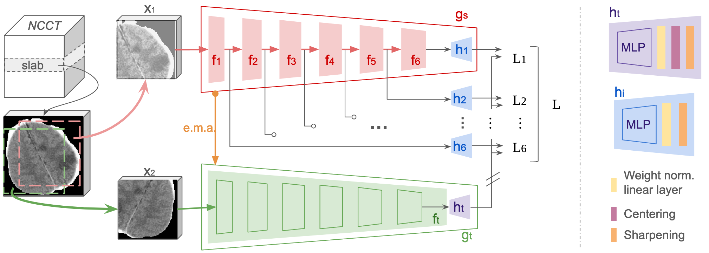

# Self-supervised learning for acute ischemic stroke final infarct lesion segmentation in Non-Contrast CT



This repository contains all the code developed for obtaining the Master is Science degree from The Erasmus Mundus Joint Masters Program on Medical Image and Applications ([MAIA](https://maiamaster.udg.edu/)) in a project conducted jointly with [icometrix](https://icometrix.com/).

The full thesis manuscript can be checked [here](MAIA_Master_Thesis.pdf).

Main contributors: 
- Joaquin Oscar Seia
- Ezequiel de la Rosa
- Diana Sima
- David Robben

## General description

Copy thesis abstract



## Repository structure

This repository is organized in the following way:
- [_data_](data) and [_dataset_](dataset): These folders contain all the code for cleaning and using the StrokeDataset class which is a uniformed way of managing the files of the different datasets used in this project.
- [_nnUnet_](nnUnet): This folder contains code which is almost entirely the same as provided in nnUNet's [repository](https://github.com/MIC-DKFZ/nnUNet/). This was originally a fork from that repoository but later it was merged with the specific codebase of the project in order to have a single repository. Main moddifications to the original nnUNet codebase take place in:
    - [nnUnet/nnunetv2/training/nnUNetTrainer/variants/cfg_file_based/](nnUnet/nnunetv2/training/nnUNetTrainer/variants/cfg_file_based/): allowing SSL pretrained weights to be loaded correctly
    - [nnUnet/nnunetv2/run/load_pretrained_weights.py](nnUnet/nnunetv2/run/load_pretrained_weights.py): Where additional configurations are used to use tailor nnUNet training pipeline for the SSL pretrained scenario.
    - [nnUnet/nnunetv2/training/logging/nnunet_logger.py](nnUnet/nnunetv2/training/logging/nnunet_logger.py): Adding tensorboard logging to nnUNet
- [_nnUnet/ssl_](nnUnet/ssl/): Contains the code necessary for training in SSL fashion nnUNet's encoder. This code was originally based on DeSD [original implementation](https://github.com/yeerwen/DeSD). However, the code was significantely changed.
- [_preprocessing_](preprocessing/): Contains the implementation of the robust preprocessing pipeline described in the thesis text. In this portion of the repository, several other repositories were used as basis:
    - In [preprocessing/registration](preprocessing/registration) wrappers will be found for [Elastix](https://elastix.lumc.nl/) software.
    - In [preprocessing/skull_stripping](preprocessing/skull_stripping), [preprocessing/super_resolution](preprocessing/skull_stripping), [preprocessing/tissue_segmentation](preprocessing/tissue_segmentation) and [preprocessing/freesurfer_utils.py](preprocessing/freesurfer_utils.py). The code is build over [Freesurfer](https://surfer.nmr.mgh.harvard.edu/)'s python codebase.
- [_utils_](utils/): Contains metrics, plots and general utils used across the complete repository.


## Using the code

In this repository we provide all the code used to train the models. However, a great part of this thesis involved the use of a private dataset (icoAIS) and a two datasets which required authorization to be downloaded and used (CENTER-TBI, APIS). As a consequence, the results are not fully reproducible, neither the data or the pretrained weights are shared.

In order to use the code provided here in one of the publicly available datasets or in one of your own:

- Setting up the environments
- Download and reorganize the image files
- Preprocess the data
- Generate the nnUNet datasets
- Train nnUNet's encoder with SSL
- Train nnUNet in supervised fashion 

## Set up the enviroments
(The usage of anaconda environments manager is assumed)

Two environments will be necessary. One for preprocessing the data and another one for running the SSL pretraining and the training of nnUNet. The reason for this is some icompatible versions between nnUNet and some of the models/code used during preprocessing.

First, update conda and change the solver to limamba for faster solving of requirements:
``` bash
conda update -n base conda &&
conda install -n base conda-libmamba-solver &&
conda config --set solver libmamba &&
source ~/anaconda3/bin/activate
```

Create **stroke** environment and install requirements:
```bash 
conda create -n stroke python==3.9 anaconda &&
conda activate stroke &&
conda install pytorch==1.13.1 torchvision==0.14.1 torchaudio==0.13.1 pytorch-cuda=11.6 -c pytorch -c nvidia &&
pip install -r requirements.txt
```

Create **nnunet_gpu** environment and install requirements:
```bash 
conda create -n nnunet_gpu python==3.9 anaconda &&
conda activate nnunet_gpu &&
cd nnUNet &&
pip install -e .
```

## Download and reorganize the image files

The only datasets that can be currently download is [AISD](https://github.com/GriffinLiang/AISD).

Once you get access to the data. The files will be standarized in name and fileformat and the proper daset csv will be generated by running:

```bash
export PYTHONPATH="${PYTHONPATH}:[<PATH_TO_THIS_PROJECT>]"
python data/clean_datasets.py -sdp '<SOURCE_DATA_PATH>' -bdp '<BIDS_DATA_PATH>'
```

The code is provided to process APIS and CENTER TBI data in case you get access to it.

## Preprocess the data

Once the data is organized in the standard format, the preprocessing can be run.

For each dataset a configuration file needs to be defined, examples are provided for the publicly available datasets in [preprocessing/cfg_files](preprocessing/cfg_files)

For some stages of the preprocessing you will need:
- Download [MNI Vascular regions template](https://zenodo.org/record/3379848#.Y_TOIezMJQJ)
- Download [MNI NCCT template](https://www.researchgate.net/publication/221969479_Age-specific_CT_and_MRI_templates_for_spatial_normalization)
- Install Elastix:
    - Download [Elastix](https://github.com/SuperElastix/elastix/releases/download/5.1.0/elastix-5.1.0-linux.zip)
    - Add elastix binaries to PATH variable:
        ```bash 
        base="<PATH_TO_ELASTIX/elastix-5.1.0-Linux" &&
        export PATH="${base}/bin":$PATH &&
        export LD_LIBRARY_PATH="${base}/lib":$LD_LIBRARY_PATH
        ```
    - Make sure Elastix can be run:
        ```bash 
        elastix -h
        ```
- Download [SynthStrip weights](https://github.com/freesurfer/freesurfer/tree/dev/mri_synthstrip) into [preprocessing/skull_stripping/models](preprocessing/skull_stripping/models)
- Download [SynthSR weights](https://github.com/freesurfer/freesurfer/tree/dev/mri_synthsr) into [preprocessing/super_resolution/models](preprocessing/super_resolution/models)
- Download [SynthSeg weights](https://github.com/freesurfer/freesurfer/tree/dev/mri_synthseg) into [preprocessing/tissue_segmentation/models](preprocessing/tissue_segmentation/models)

Once everything is downloaded and elastix is working preprocessing can be run by:
```bash
python 'preprocessing/preprocess_dataset.py' -ppcfg 'preprocessing/cfg_files/preprocessing_cfg_aisd.yml'
```

## Generate the nnUNet datasets

This can be done following the [nnUNet dataset jupyter notebook](nnUnet/nn_unet_v2_train.ipynb). Both the SSL and the supervised datasets should be obtained.

## Train nnUNet's encoder with SSL

First adecaute the [configuration file](nnUnet/ssl/cfg_files/example.yml.example) according to the SSL experiment you want to run.

Then the ssl training can be done by running:
```bash
bash nnUnet/ssl/run_ssl.sh
```

## Train nnUNet in supervised fashion

This can be done by adapting accordingly and running:
```bash
bash nnUnet/train_nnunet_example.sh
```

Once the model is trained, the inferece can be obtained by using nnUNet's terminal command (check nnUNet documentation).